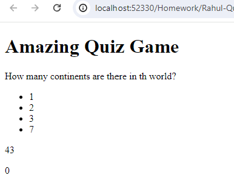

# Rahul-Quiz-show

Quiz Game

Description

This is a simple quiz game where players can answer multiple-choice questions and earn points based on their correct answers. The game includes a timer to add a time constraint to the quiz.

Technologies Used

HTML
JavaScript
CSS

Installation
Clone the repository.

Open the index.html file in a web browser.

Usage

Click the "Start Game" button to begin the quiz.

Answer the multiple-choice questions displayed.

Each correct answer earns a point, and incorrect answers deduct 2 seconds from the timer.

The game ends when all questions are answered or the timer reaches 0.

Screenshots
 

<video controls src="Assets/Incorrect Correct.mp4" title="alt text"></video>

 

Credits

Developer: [Rahul Sharma ]

Email: [rahulgaur116@gmail.com]